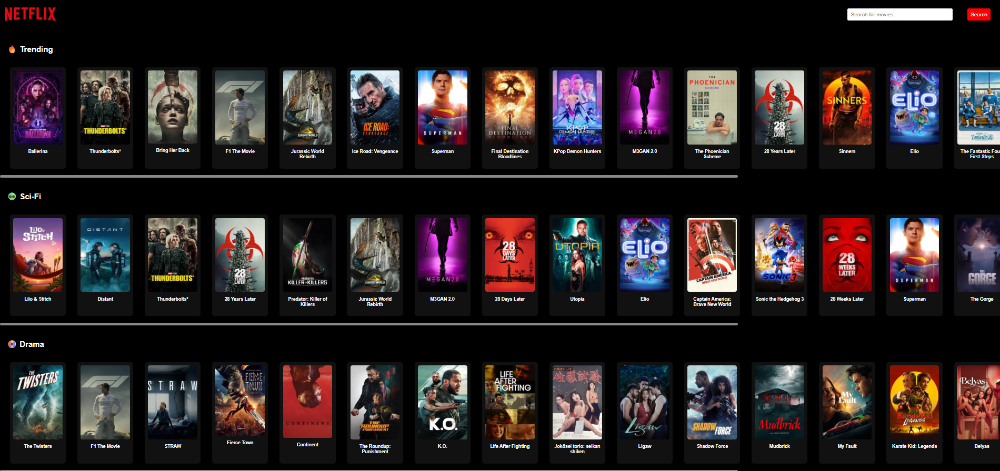
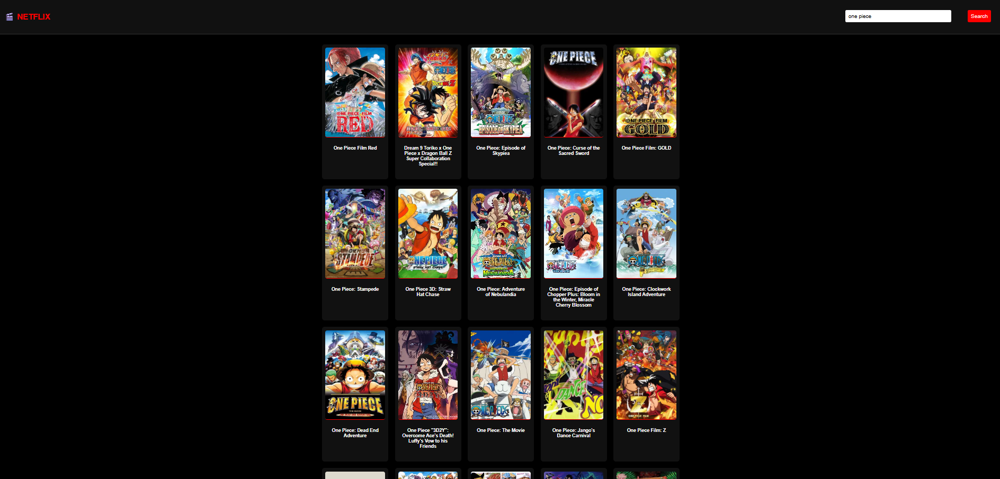
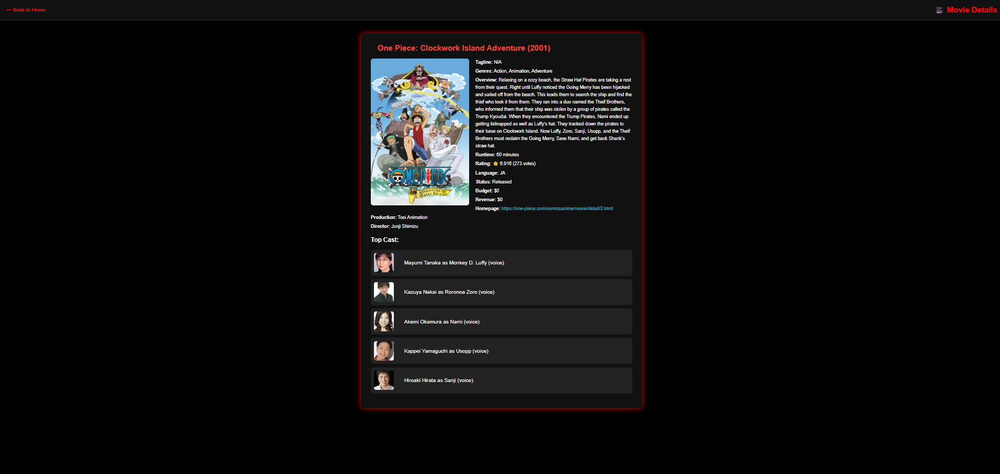

# 🎬 Netflix Clone - Movie Explorer App

A full frontend Netflix-style Movie Explorer built with **HTML, CSS, JavaScript**, and **TMDb API**.  
Users can **browse trending movies**, **search**, and **view detailed info** about each movie in a clean, professional UI.

> ✅ Built completely from scratch using modern JavaScript (DOM, Fetch API, localStorage, and modular design).

---

## 📸 Screenshots

### 🏠 Home Page (Trending & Categories)



### 🔍 Search Results Page

> Sticky header + clean movie grid with pagination support.



### 🎬 Movie Details Page

> Full movie details with top cast, director, budget, ratings, and more.



---

## 🚀 Features

- 🔥 Browse trending movies across categories
- 🔍 Live search with pagination
- 🧠 Save selected movie to `localStorage` to view details
- 🖼️ View full movie info: overview, rating, runtime, genres, production
- 👥 Top cast with profile images
- 🧑‍🎓 Beginner-friendly code with comments
- 🌐 Fully responsive and styled like Netflix

---

## 🛠️ Tech Stack

- **HTML5**, **CSS3**
- **Vanilla JavaScript**
- **TMDb API** for movie data
- **localStorage** for state persistence

---

## 🗝️ TMDb API Key Setup

This project uses **TMDb API** to fetch movie data.

### To run it yourself:

1. Visit [https://www.themoviedb.org](https://www.themoviedb.org)
2. Create a free account
3. Go to your settings → API → Generate a key
4. Replace the placeholder API key in the following files:

/script.js
/search.js
/details.js


```js
let apiKey = "YOUR_API_KEY_HERE";


📁 Project Structure

Netflix-Clone/
│
├── index.html         ← Home page
├── search.html        ← Search results page
├── details.html       ← Movie detail page
│
├── script.js          ← Homepage JS logic
├── search.js          ← Search page logic
├── details.js         ← Movie detail page logic
│
├── styles.css         ← Shared Netflix-style design
└── README.md
👨‍💻 Developer Notes
Built as a real-world project to practice:

fetch() + async/await

localStorage usage

DOM manipulation

Dynamic HTML rendering

Movie data updates live from TMDb API

Designed to be fully modular and easy to expand

🙋‍♂️ Contributing
Pull requests and suggestions are welcome!

📄 License
MIT License — Feel free to fork and customize.

💬 Built with ❤️ by Muntazir Mushtaq — 2025
